# LIMES Mobile (React Native)

Bản mobile của LIMES Medical E-Reader, migrate từ web app vanilla HTML ở thư mục gốc repo.

## Chạy thử

```bash
cd mobile
npm install
npx expo start
```

Quét QR bằng **Expo Go** trên iOS/Android, hoặc nhấn `i` / `a` để mở simulator/emulator.

## Giao diện

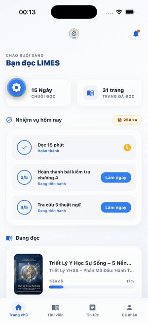

| | | |
|:--:|:--:|:--:|
| 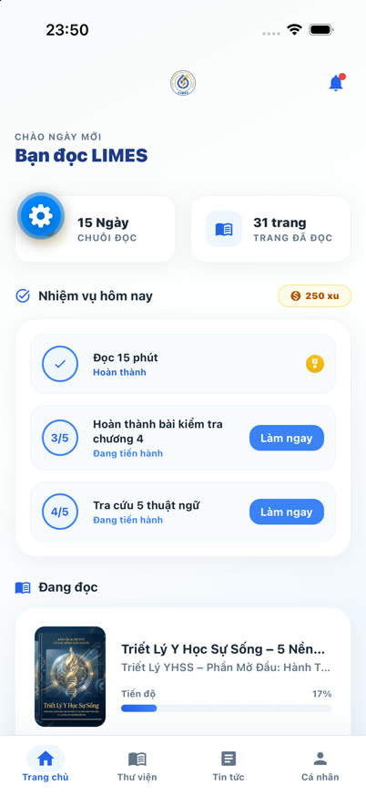<br>Trang chủ | 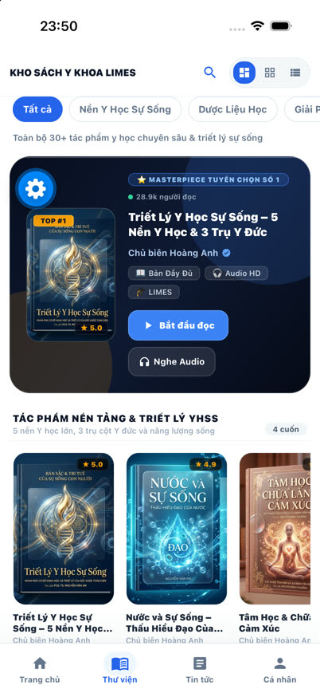<br>Thư viện (hub) | 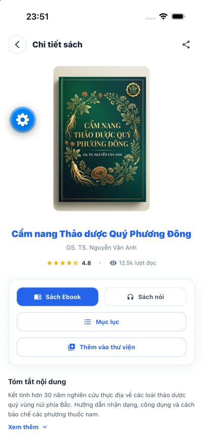<br>Chi tiết sách |
| 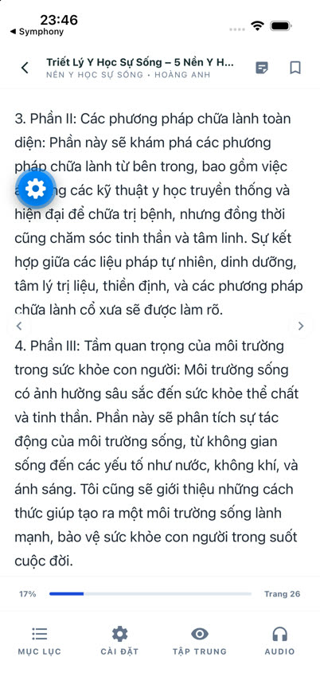<br>E-Reader | 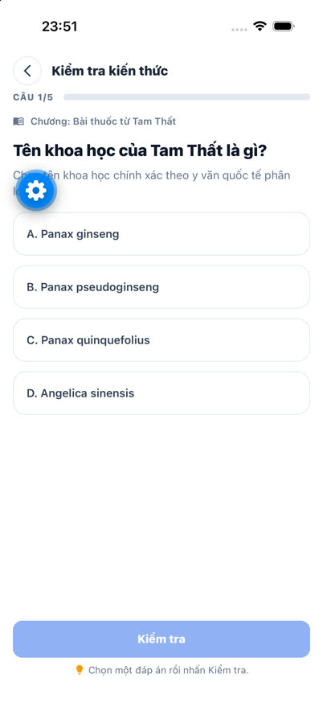<br>Trắc nghiệm | 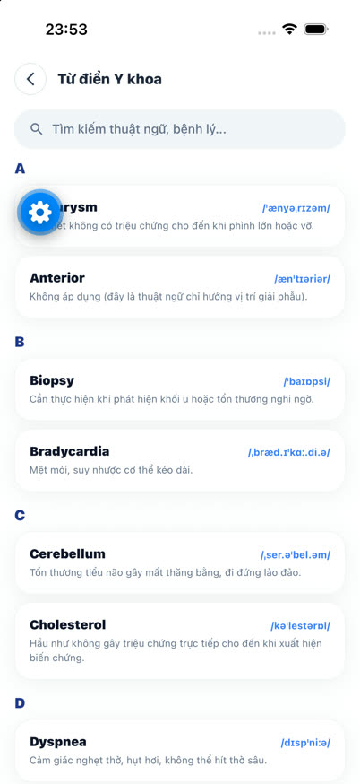<br>Từ điển |
| 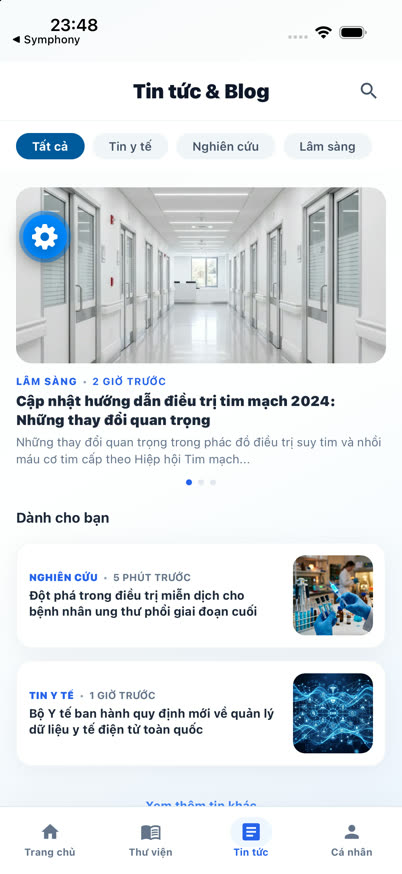<br>Tin tức | 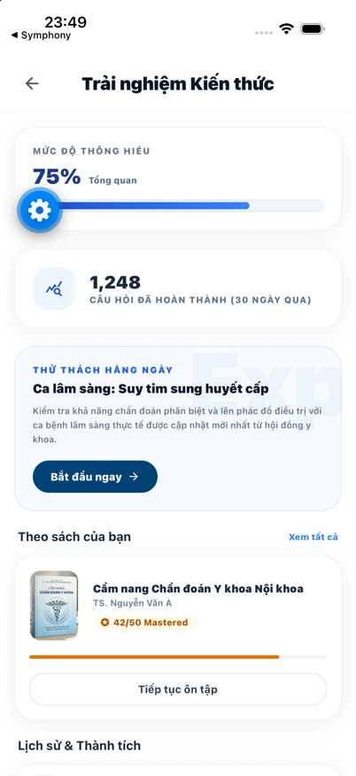<br>Kiến thức | <br>Sách nói |
| 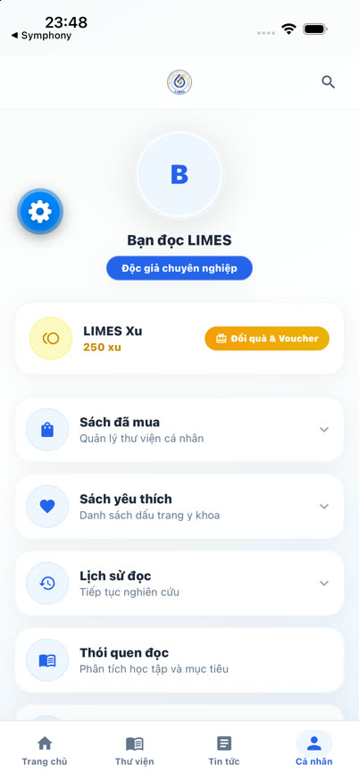<br>Cá nhân | 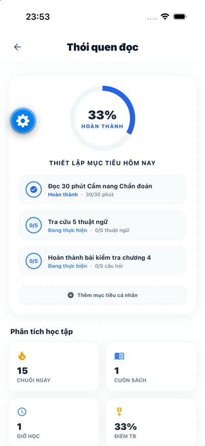<br>Thói quen đọc | |

Chụp trên iPhone 17 Pro simulator (iOS 27). Nút bánh răng xanh nổi trên ảnh là dev-menu của Expo Go, không phải giao diện app.

## Stack

| Thành phần | Lựa chọn |
|---|---|
| Runtime | Expo SDK 57 (managed), React Native 0.86, React 19 |
| Điều hướng | `expo-router` (file-based, typed routes) |
| Styling | React Native `StyleSheet` + design tokens (`src/theme/tokens.ts`) |
| State | Zustand + persist qua AsyncStorage |
| Backend | Firebase JS SDK — Auth + Firestore (chung project `gems-ebook` với web) |
| Nội dung chương | `react-native-webview` (xem *Kiến trúc E-Reader*) |
| Ảnh | `expo-image` (covers dạng `.webp`) |

**Không dùng NativeWind/Tailwind.** Bản stable của NativeWind (4.2.6) chưa hỗ trợ RN 0.86 / new architecture, nên toàn bộ UI dùng `StyleSheet` với token tập trung ở `src/theme/tokens.ts` — mọi màu, spacing, radius, font size đều lấy từ đó.

## Cấu trúc

```
mobile/
├── app/                        # expo-router: mỗi file là một route
│   ├── _layout.tsx             # providers + splash + AuthGate
│   ├── onboarding.tsx  login.tsx
│   ├── (tabs)/                 # bottom nav: Trang chủ · Thư viện · Tin tức · Cá nhân
│   ├── book/[id]/              # chi tiết sách + mục lục
│   ├── reader/[bookId].tsx     # e-reader
│   ├── quiz/[chapterId].tsx
│   ├── audiobook/[bookId].tsx
│   ├── dictionary/  author/  news/  knowledge/  profile/
│   └── search.tsx
└── src/
    ├── theme/tokens.ts         # design tokens (màu, spacing, reader themes, highlight colors)
    ├── components/             # Screen, AppHeader, Button, Chip, BookPoster/GridTile/ListRow...
    ├── data/                   # catalog, chapters, quizzes, dictionary + JSON nguồn
    ├── store/app-store.ts      # port của window.appState
    └── services/               # firebase.ts, cloud-sync.ts
```

## Kiến trúc E-Reader

`chapters.json` lưu **nội dung mỗi trang dưới dạng chuỗi HTML kèm class Tailwind** (viết cho web). Chuyển 370KB HTML đó sang component React Native là không khả thi và sẽ mất toàn bộ typography.

Vì vậy reader được chia đôi:

- **Chrome native** — header, thanh dưới, mục lục, menu cài đặt (theme + cỡ chữ), nút bookmark, thanh tiến độ: đều là component React Native thật.
- **Vùng nội dung là WebView** — dựng một document HTML nhúng sẵn CSS, chèn theme `readerThemes` (Trắng / Sepia / Tối) và `readerFontScale`, rồi đổ chuỗi HTML của trang vào body.
- **Không phụ thuộc CDN** — thay vì nạp Tailwind Play CDN (khiến mỗi trang sách cần mạng), các class Tailwind mà nội dung sách thực sự dùng được biên dịch sẵn thành 4KB CSS tĩnh ở `src/data/chapter-tailwind-css.ts`. Sinh lại bằng `npm run build:chapter-css` khi nội dung sách thay đổi.
- **Cầu nối `postMessage`** — WebView gửi sự kiện bôi đen văn bản và chạm thuật ngữ y khoa về RN; RN hiện thanh công cụ native (highlight / ghi chú / tra từ điển).

## Dữ liệu

`src/data/` chứa bản copy của dữ liệu web, đóng gói sẵn trong app (đọc offline được):

| File | Nguồn | Nội dung |
|---|---|---|
| `book-data-map.json` | `js/modules/data.js` | 30 đầu sách + category, tags |
| `category-hubs.json` | `js/modules/data.js` | 6 hub kiểu Netflix |
| `chapters.json` | `data/chapters.json` | 11 chương, nội dung HTML |
| `quizzes.json` | `index.html` (inline) | 8 bộ trắc nghiệm × 5 câu |
| `dictionary.json` | `data/dictionary.json` | từ điển y khoa |
| `cover-images.ts` | sinh tự động | registry `require()` tĩnh cho ảnh bìa |
| `chapter-tailwind-css.ts` | sinh tự động | CSS Tailwind tĩnh cho nội dung chương |

`cover-images.ts` tồn tại vì React Native không `require()` được từ chuỗi động — mọi ảnh bìa phải khai báo tĩnh. Luôn lấy ảnh qua `resolveCover(book.cover)`.

## Đồng bộ Firebase

Dùng chung project `gems-ebook` và chung document `user_sessions/{userId}` với web, đúng schema của `js/modules/state.js` (`userCoins`, `streakDays`, `bookmarks`, `highlights`, `notes`, `userVouchers`, `lastReadingPosition`). Ghi được debounce 1.5s; có listener realtime kéo thay đổi từ cloud về store.

API key Firebase Web không phải bí mật — nó định danh project và có mặt trong mọi client. Quyền truy cập do Firestore rules kiểm soát.

> **Đang lỗi:** Firestore từ chối mọi ghi vào `user_sessions` — `FirebaseError: Missing or insufficient permissions`. App không vỡ (local là nguồn sự thật, lỗi cloud chỉ ghi warning) nhưng đồng bộ đám mây chưa thực sự chạy. Đây là vấn đề có sẵn từ web: `js/modules/state.js` cũng ghi vào đúng collection đó mà không đăng nhập Firebase. Cần sửa Firestore rules, hoặc thêm `signInAnonymously()` kèm rule `request.auth != null`.

## Phạm vi

Đã migrate: onboarding, login, home, thư viện + tìm kiếm + hub chuyên khoa, chi tiết sách, mục lục, hồ sơ tác giả, e-reader, quiz, từ điển, audiobook, tin tức/blog, hồ sơ cá nhân + phần thưởng + thói quen đọc.

Chưa migrate: cụm shop/thương mại điện tử (~20 màn của web app).

Không có test — theo yêu cầu migrate nhanh.

Hạn chế đã biết:

- Ảnh minh họa *bên trong* nội dung chương vẫn trỏ URL remote từ HTML gốc → cần mạng.
- Font Playfair Display chưa bundle nên chế độ Serif fallback về Georgia/Times.
- Highlight lưu theo khớp chuỗi trong một text node; đoạn bôi đen vắt qua nhiều thẻ vẫn lưu và liệt kê đúng nhưng không tô lại sau khi mở lại.
- Một số số liệu (theo dõi tác giả, đánh giá sách, "1.248 câu hỏi") giữ nguyên dữ liệu demo của web vì không có nguồn thật.
